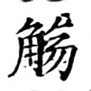

# Generating handwritten Chinese characters using CycleGAN

We use CycleGAN to generate handwritten Chinese characters.

## LANTING


## BAOTA



## Train

```python
python train.py --cuda --dataroot datasets/lantingkai/ --input_nc 1 --output_nc 1
```

```python
python train.py --cuda --dataroot datasets/baotakai/ --input_nc 1 --output_nc 1
```

## Test

```python
python test.py --dataroot datasets/lantingkai/ --cuda --input_nc 1 --output_nc 1
```

```python
python test.py --dataroot datasets/baotakai/ --cuda --input_nc 1 --output_nc 1
```

# Original Repository

# Pytorch-CycleGAN

A clean and readable Pytorch implementation of CycleGAN (https://arxiv.org/abs/1703.10593)

## Prerequisites

Code is intended to work with `Python 3.6.x`, it hasn't been tested with previous versions

### [PyTorch & torchvision](http://pytorch.org/)

Follow the instructions in [pytorch.org](http://pytorch.org) for your current setup

### [Visdom](https://github.com/facebookresearch/visdom)

To plot loss graphs and draw images in a nice web browser view

```
pip3 install visdom
```

## Training

### 1. Setup the dataset

First, you will need to download and setup a dataset. The easiest way is to use one of the already existing datasets on UC Berkeley's repository:

```
./download_dataset <dataset_name>
```

Valid <dataset_name> are: apple2orange, summer2winter_yosemite, horse2zebra, monet2photo, cezanne2photo, ukiyoe2photo, vangogh2photo, maps, cityscapes, facades, iphone2dslr_flower, ae_photos

Alternatively you can build your own dataset by setting up the following directory structure:

    .
    ├── datasets
    |   ├── <dataset_name>         # i.e. brucewayne2batman
    |   |   ├── train              # Training
    |   |   |   ├── A              # Contains domain A images (i.e. Bruce Wayne)
    |   |   |   └── B              # Contains domain B images (i.e. Batman)
    |   |   └── test               # Testing
    |   |   |   ├── A              # Contains domain A images (i.e. Bruce Wayne)
    |   |   |   └── B              # Contains domain B images (i.e. Batman)

### 2. Train!

```
./train --dataroot datasets/<dataset_name>/ --cuda
```

This command will start a training session using the images under the _dataroot/train_ directory with the hyperparameters that showed best results according to CycleGAN authors. You are free to change those hyperparameters, see `./train --help` for a description of those.

Both generators and discriminators weights will be saved under the output directory.

If you don't own a GPU remove the --cuda option, although I advise you to get one!

You can also view the training progress as well as live output images by running `python3 -m visdom` in another terminal and opening [http://localhost:8097/](http://localhost:8097/) in your favourite web browser. This should generate training loss progress as shown below (default params, horse2zebra dataset):


## Testing

```
./test --dataroot datasets/<dataset_name>/ --cuda
```

This command will take the images under the _dataroot/test_ directory, run them through the generators and save the output under the _output/A_ and _output/B_ directories. As with train, some parameters like the weights to load, can be tweaked, see `./test --help` for more information.

Examples of the generated outputs (default params, horse2zebra dataset):


## License

This project is licensed under the GPL v3 License - see the [LICENSE.md](LICENSE.md) file for details

## Acknowledgments

Code is basically a cleaner and less obscured implementation of [pytorch-CycleGAN-and-pix2pix](https://github.com/junyanz/pytorch-CycleGAN-and-pix2pix). All credit goes to the authors of [CycleGAN](https://arxiv.org/abs/1703.10593), Zhu, Jun-Yan and Park, Taesung and Isola, Phillip and Efros, Alexei A.

# Handwritten-CycleGAN on Modal

This repository contains an implementation of CycleGAN that can be run locally or on [Modal](https://modal.com/) for faster cloud-based training.

## Requirements

For local development:

- Python 3.7+
- PyTorch
- torchvision
- PIL
- visdom (for visualization when running locally)
- tensorboard (for visualizing Modal training results)

For Modal deployment:

- Modal CLI
- Modal Python package

## Setup

1. Install Modal:

```bash
pip install modal
```

2. Authenticate with Modal:

```bash
modal token new
```

3. Make sure your dataset is organized in the expected format (by default, `datasets/horse2zebra/`):

```
datasets/
└── horse2zebra/
    ├── trainA/  # Domain A training images (horses)
    ├── trainB/  # Domain B training images (zebras)
    ├── testA/   # Domain A test images
    └── testB/   # Domain B test images
```

## Training on Modal

The `modal_train.py` script is configured to run the CycleGAN training on Modal's cloud infrastructure with GPU acceleration:

```bash
python modal_train.py
```

This will:

1. Package your code and upload it to Modal
2. Provision an A100 GPU instance
3. Install necessary dependencies
4. Run the training process
5. Save model checkpoints to the `output/` directory
6. Store visualization data (loss plots and sample images) in a Modal volume

## Visualizing Training Progress

Instead of using Visdom for real-time visualization (which doesn't work well with Modal), this implementation:

1. Uses TensorBoard to log loss metrics
2. Saves sample images periodically during training
3. Stores all this data in a Modal volume named "cyclegan-viz"

After training completes, you can use the included helper script to download and visualize the training data:

```bash
python modal_viz.py
```

This script will:

1. Download the visualization data from Modal's "cyclegan-viz" volume
2. Start a local TensorBoard server to view the training metrics
3. Provide information about the saved sample images

You can also manually download the visualization data:

```bash
modal volume get cyclegan-viz --dest ./viz_data
```

And then:

- View TensorBoard logs: `tensorboard --logdir=./viz_data/tensorboard`
- Browse sample images in the `./viz_data/samples` directory

## Inference on Modal

After training your model, you can use the `modal_inference.py` script to transform images using the trained generators:

```bash
python modal_inference.py --input path/to/input.jpg --output path/to/output.jpg --model output/199_netG_A2B.pth --direction A2B
```

Arguments:

- `--input`: Path to the input image
- `--output`: Path where the transformed image will be saved
- `--model`: Path to the generator model file (.pth)
- `--direction`: Transformation direction, either "A2B" (e.g., horse→zebra) or "B2A" (e.g., zebra→horse)
- `--size`: Image size for processing (default: 256)

This will use a T4 GPU on Modal for efficient inference.

## Customizing Training Parameters

You can modify the training parameters in the `main()` function of `modal_train.py`:

```python
@stub.local_entrypoint()
def main():
    train_cyclegan(
        epoch=0,           # Starting epoch
        n_epochs=200,      # Total number of epochs
        batch_size=6,      # Batch size
        dataroot="datasets/horse2zebra/",  # Dataset location
        lr=0.0002,         # Learning rate
        decay_epoch=100,   # Epoch to start learning rate decay
        size=128,          # Image size
        input_nc=3,        # Number of input channels
        output_nc=3,       # Number of output channels
        n_cpu=8            # Number of CPU threads for data loading
    )
```

## Running Locally

You can still use the original `train.py` script for local training with Visdom visualization:

```bash
python train.py --dataroot datasets/horse2zebra/ --cuda
```

For local training with Visdom:

1. Start the Visdom server in a separate terminal: `python -m visdom.server`
2. Open http://localhost:8097 in your browser
3. Run the training script as above

Add the `--cuda` flag if you have a GPU available.
